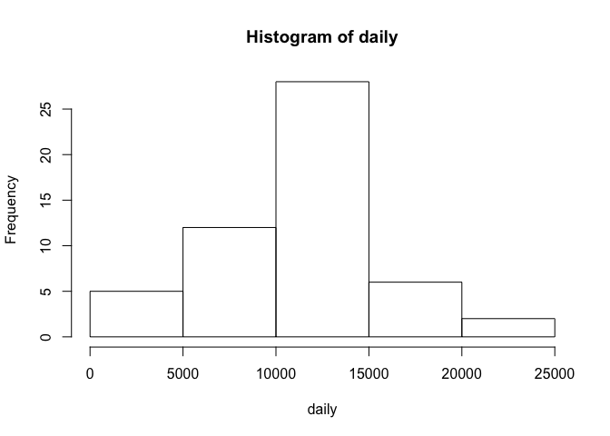

# Reproducible Research: Peer Assessment 1


## Loading and preprocessing the data
Here is R code unzipping, reading data from file and removing NA values

```r
unzip ('activity.zip')
data <- read.csv('activity.csv')
data <- data[complete.cases(data),]
```


## What is mean total number of steps taken per day?

```r
daily <- tapply(data$steps, data$date, FUN=sum)
daily <- daily[complete.cases(daily)]
hist(daily)
```

 

```r
mean(daily)
```

```
## [1] 10766.19
```

```r
median(daily)
```

```
## [1] 10765
```

## What is the average daily activity pattern?


## Imputing missing values


## Are there differences in activity patterns between weekdays and weekends?
