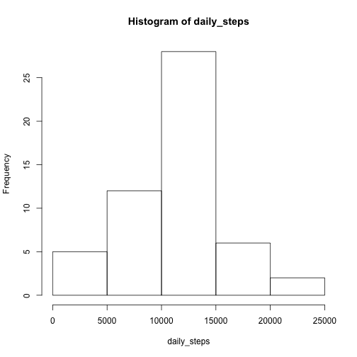
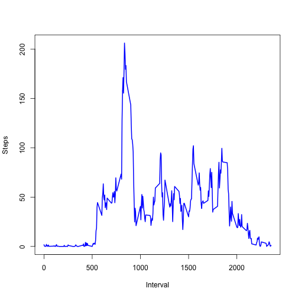
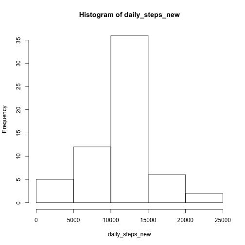

## Loading and preprocessing the data
Here is R code unzipping, reading data from file and removing NA values

```r
unzip ('activity.zip')
data <- read.csv('activity.csv')
```


## What is mean total number of steps taken per day?
Calculating total steps a day and writing to a vector.  
1. Making a histogram of the total number of steps taken each day.

```r
daily_steps <- tapply(data$steps, data$date, FUN=sum)
hist(daily_steps)
```

 

2. Calculating and reporting the mean and median total number of steps taken per day

```r
mean(daily_steps, na.rm=TRUE)
```

```
## [1] 10766.19
```

```r
median(daily_steps, na.rm=TRUE)
```

```
## [1] 10765
```

## What is the average daily activity pattern?

1. Making a time series plot (i.e. type = "l") of the 5-minute interval (x-axis) and the average number of steps taken, averaged across all days (y-axis)

```r
ts <- aggregate(steps~interval, data, FUN=mean)
plot(ts$interval,ts$steps, type='l', xlab= 'Interval', ylab= 'Steps', col='blue' , lwd=2)
```

 

2. Which 5-minute interval, on average across all the days in the dataset, contains the maximum number of steps?

```r
ts$interval[which.max(ts$steps)]
```

```
## [1] 835
```

## Imputing missing values

Note that there are a number of days/intervals where there are missing values (coded as NA). The presence of missing days may introduce bias into some calculations or summaries of the data.

1. Calculate and report the total number of missing values in the dataset (i.e. the total number of rows with NAs)


```r
sum(is.na(data))
```

```
## [1] 2304
```

2. Devise a strategy for filling in all of the missing values in the dataset. The strategy does not need to be sophisticated. For example, you could use the mean/median for that day, or the mean for that 5-minute interval, etc.  
I am going to use the mean for this 5-minute interval.  
The 'replace' function checks if data for interval is missing and replace it with 5-interval mean.  

```r
ts <- aggregate(steps~interval, data, FUN=mean)
replace <- function(x, d=data, t=ts) {
        if(is.na(d$steps[x])){
                t$steps[which(t$interval==d$interval[x])]
                }else{
                        d$steps[x]
                        }
        }
```

3. Create a new dataset that is equal to the original dataset but with the missing data filled in.


```r
new_data <- data
index <- is.na(data[,1])
new_data[index,1] <- sapply(which(index),FUN=replace)
```

4. Make a histogram of the total number of steps taken each day and Calculate and report the mean and median total number of steps taken per day. Do these values differ from the estimates from the first part of the assignment? What is the impact of imputing missing data on the estimates of the total daily number of steps?


```r
daily_steps_new <- tapply(as.numeric(new_data$steps), new_data$date, FUN=sum)
hist(daily_steps_new)
```

 

```r
mean(daily_steps_new)
```

```
## [1] 10766.19
```
Mean total number of steps taken per day is the same as in the first part, as we impute mean. 

```r
median(daily_steps_new)
```

```
## [1] 10766.19
```
Median total number shifts towards mean value as we added significant number of mean values instead NA.  
The number of observations and total number of steps increased after imputing data, you can see this on the histogram.  

## Are there differences in activity patterns between weekdays and weekends?

For this part the weekdays() function may be of some help here. Use the dataset with the filled-in missing values for this part.

1. Create a new factor variable in the dataset with two levels -- "weekday" and "weekend" indicating whether a given date is a weekday or weekend day.

```r
weekend <- c('Saturday','Sunday')
data$wday <- factor (weekdays(as.Date(data$date)) %in% weekend, levels=c(FALSE,TRUE), labels=c('weekday', 'weekend') )
```

2. Make a panel plot containing a time series plot (i.e. type = "l") of the 5-minute interval (x-axis) and the average number of steps taken, averaged across all weekday days or weekend days (y-axis). The plot should look something like the following, which was created using simulated data:

```r
ts <- aggregate(steps~interval+wday, data, FUN=mean)
library(lattice)
xyplot(steps~interval|wday, ts, layout=c(1,2), type ='l')
```

 
