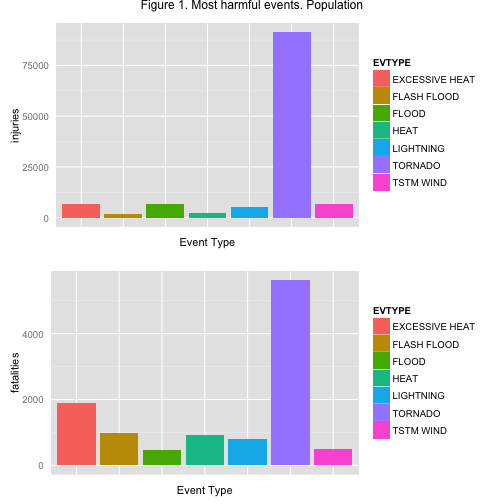
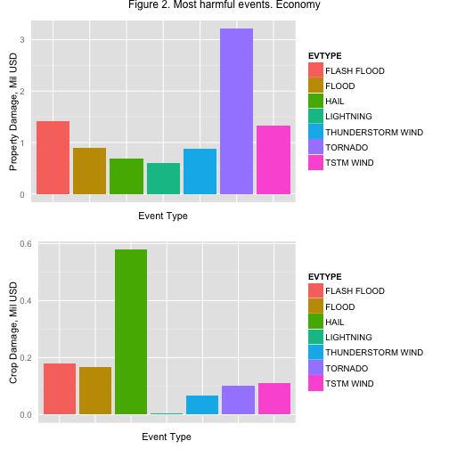

The Impact of the Severe Weather Events on Human Health and Economy
======================
##Synopsys

The goal of this study was to find out the impact of the most devastating weather events both on the population health and economy. The basis of the study is the information of the NOAA Storm Database representing observations which was made across the United States in the period from 1950 to 2011 year.  
To achieve this goals we have made processing of the data represented by National Weather Service Storm Data Documentation.   
To make our results fully reproducible we present:
* The link to the source data
* R script 
* Results:
        * Most harmful events affecting on on the population
        * Most harmful events affecting on on economy

Brief straightforward analysis of given graphs shows that most devastating weather event in the USA is tornadoes followed by floods and heat.


##Source Data 

Please download file from
* Storm Data [47Mb] (https://d396qusza40orc.cloudfront.net/repdata%2Fdata%2FStormData.csv.bz2)

##Data Processing
Unzipping and reading data from .csv file

```r
library(data.table)
library(R.utils)
zip_file <- 'repdata-data-StormData.csv.bz2'
bunzip2(zip_file, remove = FALSE)
```

```
## Error in decompressFile.default(filename = filename, ..., ext = ext, FUN = FUN): File already exists: repdata-data-StormData.csv
```

```r
file <- 'repdata-data-StormData.csv'
data <- fread(file)
```

```
## 
Read 0.0% of 967216 rows
Read 20.7% of 967216 rows
Read 34.1% of 967216 rows
Read 42.4% of 967216 rows
Read 53.8% of 967216 rows
Read 65.1% of 967216 rows
Read 73.4% of 967216 rows
Read 80.6% of 967216 rows
Read 87.9% of 967216 rows
Read 902297 rows and 37 (of 37) columns from 0.523 GB file in 00:00:14
```

```
## Warning in fread(file): Read less rows (902297) than were allocated
## (967216). Run again with verbose=TRUE and please report.
```
Calculating total by the type of the events

```r
library(plyr)
data$EVTYPE <- factor(data$EVTYPE)
totals <- ddply(data,.(EVTYPE), summarize, injuries=sum(INJURIES), fatalities=sum(FATALITIES), propdmg=sum(PROPDMG)/1000000, cropdmg=sum(CROPDMG)/1000000)
```
Removing empty values

```r
tot1<-totals[(totals$injuries>5000 | totals$fatalities>400),] # Filtering the most harmful events
tot2<-totals[(totals$propdmg>0.5 | totals$cropdmg>0.05),] # Filtering the most devastating events
```

##Results
### Most harmful events affecting on on the population

```r
library(ggplot2)
library(grid)
library(gridExtra)
p1 <- ggplot(tot1, aes(x=EVTYPE, y=injuries, fill=EVTYPE)) + geom_bar(stat="identity") + theme(axis.ticks = element_blank(), axis.text.x = element_blank(), axis.title.x = element_text(size=11), axis.title.y = element_text(size=11)) + xlab('Event Type')
p2 <- ggplot(tot1, aes(x=EVTYPE, y=fatalities, fill=EVTYPE)) + geom_bar(stat="identity") + theme(axis.ticks = element_blank(), axis.text.x = element_blank(), axis.title.x = element_text(size=11), axis.title.y = element_text(size=11)) + xlab('Event Type')
g1<-grid.arrange(p1, p2, nrow=2, main="Figure 1. Most harmful events. Population")
```

 

### Most harmful events affecting on on the economy 

```r
q1 <- ggplot(tot2, aes(x=EVTYPE, y=propdmg, fill=EVTYPE)) + geom_bar(stat="identity") + theme(axis.ticks = element_blank(), axis.text.x = element_blank(), axis.title.x = element_text(size=11), axis.title.y = element_text(size=11)) + xlab('Event Type') + ylab('Property Damage, Mil USD')
q2 <- ggplot(tot2, aes(x=EVTYPE, y=cropdmg, fill=EVTYPE)) + geom_bar(stat="identity") + theme(axis.ticks = element_blank(), axis.text.x = element_blank(), axis.title.x = element_text(size=11), axis.title.y = element_text(size=11)) + xlab('Event Type') + ylab('Crop Damage, Mil USD')
g2<-grid.arrange(q1, q2, nrow=2, main="Figure 2. Most harmful events. Economy")
```

 

